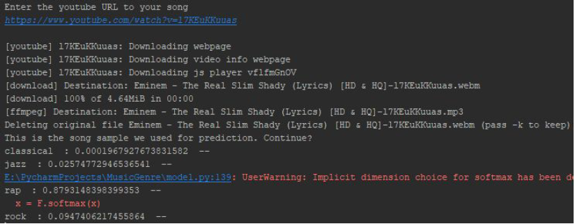

# MusicGenre
MIE324 Deep Learning Project

A music genre classifier trained using deep learning and neural networks, that outputs the predicted genre and confidence level (0-1) of any piece of mp3 audio sample. 

The UI allows the user to enter a YouTube link of the song, and automatically outputs the confidence level in each genre (shown below).

By Bill Sun and Robert Adrangna

Please read the full project report <a href="./MusicGenre Final Report.pdf">here</a>
