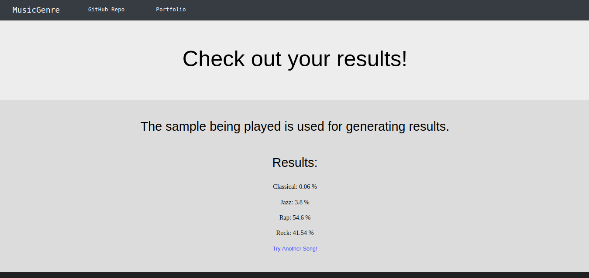

# MusicGenre
MIE324 Deep Learning Project

A music genre classifier trained using deep learning and neural networks, that outputs the predicted genre and confidence level (0-1) of any piece of mp3 audio sample. 

The UI allows the user to enter a YouTube link of the song before downloading it internally, or upload an mp3 file, and automatically outputs the confidence level in each genre (shown below).

To run the demo yourself, copy the repository to your local computer. Run "demo/app.py", and click on the localhost link.

By Bill Sun and Robert Adrangna

Please read the full project report <a href="./reports/MusicGenre Final Report.pdf">here</a>
